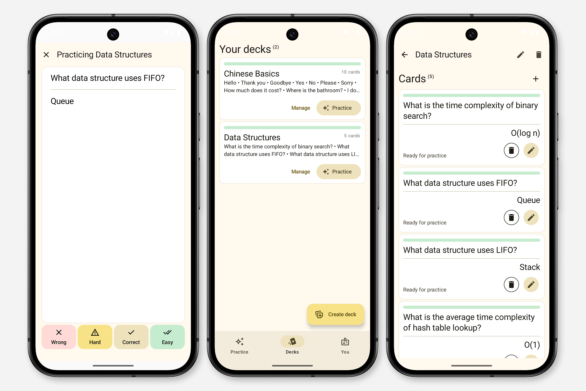

# Recur

Recur is an Android app for practicing flashcards using spaced repetition. Users can create and manage decks, edit cards (CRUD), and enter a play mode to review them. The home screen provides an automatic feed of cards that are due for practice.

The project focuses on clean architecture, local-first persistence, and a modern Compose-based UI.

*Disclaimer: This is a personal side project. It is not intended for production nor distribution.*

*Status: Functional but not completely finished.*

## Tech Stack
- Kotlin
- Jetpack Compose
- Jetpack Navigation
- SQLDelight (local persistence)
- Koin (dependency injection)

## Architecture

The project follows Clean Architecture and is split into the following layers:

- app – Compose UI, app setup and navigation
- presentation – ViewModels (MVVM)
- domain – Business logic
- data – Room database

The domain layer owns the scheduling logic, while the data layer handles persistence and mapping between entities and domain models.

## Features

- Deck and card management (full CRUD)
- Spaced repetition review flow
- Automatic due-card feed
- JSON import support
- Local-first storage with SQLDelight

## Planned features

- Reminder notifications
- Streak tracking
- Additional settings
